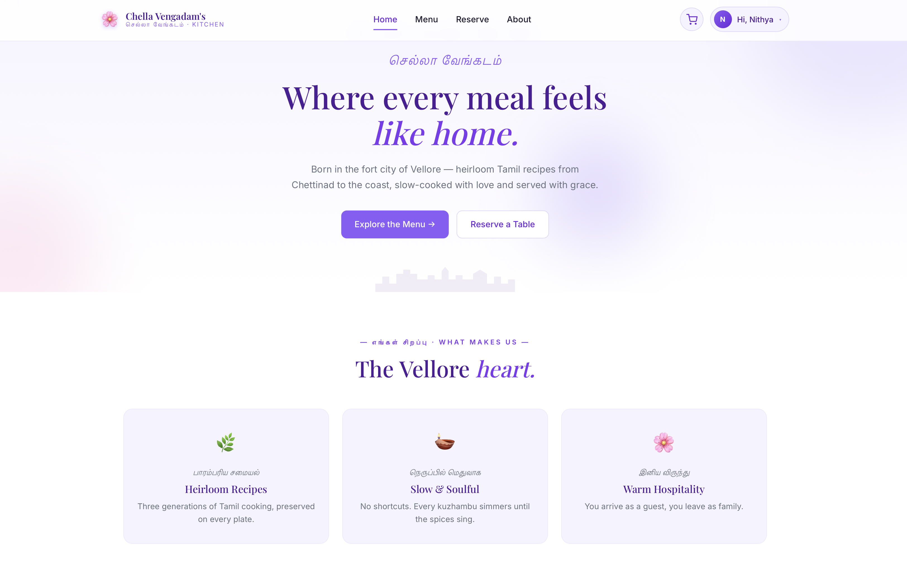
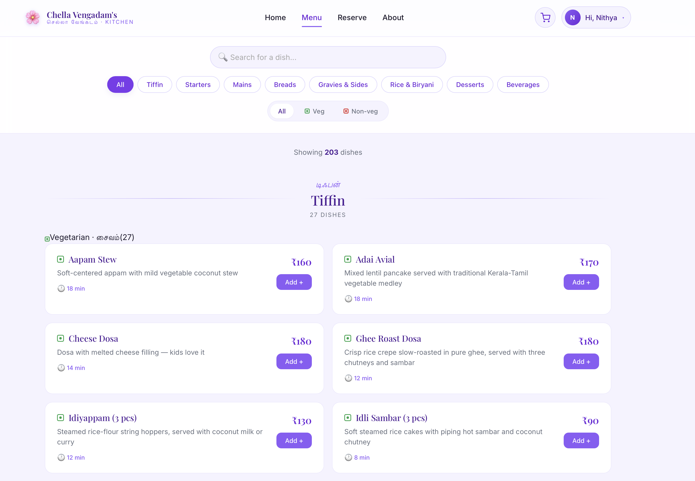
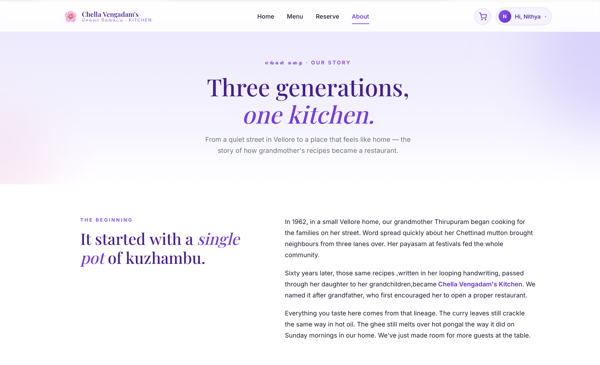

<div align="center">

# Chella Vengadam's Kitchen
### *செல்லா வேங்கடம் · ஒரு குடும்பத்தின் சமையலறை*

**A full-stack restaurant management system inspired by a Tamil family's heritage kitchen in Vellore.**

Designed and built end-to-end by [Nithya](https://github.com/Nithya1408), from database schema to deployed UI.

[Live Demo](#) · [Features](#features) · [Tech Stack](#tech-stack) · [Setup](#getting-started)

</div>

## About the Project

Chella Vengadam's Kitchen is a complete restaurant operations platform, built as a portfolio project to demonstrate real-world full-stack capability. It serves three distinct user types from a single codebase.

Customers browse a 200+ dish menu, place orders, and reserve tables. Kitchen staff work through a live, auto-refreshing order queue. Admins manage everything through a multi-tab dashboard with sales analytics.

The design intentionally avoids generic SaaS aesthetics. Tamil typography, a lavender palette, and references to Vellore give the restaurant a real cultural identity instead of looking like a stock template.

## Screenshots

### Home
*Tamil heritage meets modern UI.*



### Menu
*204 dishes across 8 categories with smart filtering.*



### Admin Overview
*KPIs, sales chart, top sellers.*


### Kitchen View
*Live order queue with urgency indicators.*


### About
*Storytelling driven design.*



## Features

### Customer Experience
- Menu browsing with 204 dishes organised into 8 categories (Tiffin, Starters, Mains, Rice & Biryani, Breads, Gravies & Sides, Desserts, Beverages)
- Smart filtering with search, category filter, and vegetarian / non-vegetarian toggle using Indian dietary indicators
- Persistent cart via localStorage, GST calculation, three order types (dine-in, takeaway, delivery), three payment methods
- Visual table reservation with capacity-grouped picker, time slot selection, and automatic conflict detection on a 2 hour window
- Order confirmation with friendly order numbers (CV00001 format)

### Authentication and Authorization
- JWT based auth with 7-day token expiry and bcrypt password hashing (10 salt rounds)
- Three roles, each with distinct UI and route access: customer, staff, admin
- Persistent sessions that auto-load the current user from /api/auth/me on app reload
- Axios interceptor that attaches the JWT to every authenticated request
- Protected routes with role based access (admin only, or staff and admin)

### Admin Dashboard
- Overview tab with 6 colour coded KPI cards, a 7-day revenue area chart built with custom SVG (no chart library dependency), and top 5 best-selling dishes
- Orders tab with a filterable table and inline status workflow: pending, preparing, ready, served, completed
- Reservations tab with a card grid, confirm / cancel actions, and upcoming / past filtering
- Menu management to toggle dish availability live, with search and filter by category
- Inventory with editable stock cards, quick-add buttons (+1, +5, +10, +25), low stock warnings, and reorder thresholds

### Kitchen View
- A 3-column live board: New Orders, In Kitchen, Ready
- Auto-refresh every 10 seconds for a near real-time feel without WebSockets
- Urgency states: cards turn amber at 10 minutes and red with a pulsing border at 20 minutes
- One click status advance to move orders through the pipeline

### Data Integrity
- Atomic transactions for order placement so order and order_items rows stay consistent
- Foreign key constraints with appropriate CASCADE / SET NULL behaviour
- Reservation conflict detection using TIMESTAMPDIFF on a CONCAT'd date and time

## Tech Stack

### Frontend
- React 19 with Vite
- React Router v7 for client-side routing with protected routes
- Context API for global state (cart and auth)
- Axios with a token interceptor
- Custom SVG charts (no Recharts dependency)
- Plain CSS with a custom design system built on CSS variables

### Backend
- Node.js with Express
- MySQL (MariaDB compatible) for persistence
- mysql2/promise as the async database driver
- jsonwebtoken for stateless authentication
- bcryptjs for password hashing
- CORS and dotenv for standard middleware

### Database (9 tables)
users, categories, menu_items, restaurant_tables, reservations, orders, order_items, inventory, staff

## Getting Started

### Prerequisites
- Node.js v18 or newer
- MySQL 8+ or MariaDB 10+
- npm

### Setup

```bash
# Clone the repo
git clone https://github.com/Nithya1408/chella-vengadam-kitchen.git
cd chella-vengadam-kitchen

# Install backend dependencies
cd backend
npm install

# Install frontend dependencies
cd ../frontend
npm install
```

### Configure the database

Open MySQL and create the database:

```sql
CREATE DATABASE chella_vengadam_db;
```

Run the schema and seed scripts (see the /database folder or contact the author for the SQL files).

### Configure environment variables

Create backend/.env:

```env
DB_HOST=localhost
DB_PORT=3306
DB_USER=root
DB_PASSWORD=your_password
DB_NAME=chella_vengadam_db

PORT=5000

JWT_SECRET=your_super_secret_jwt_key
```

### Run the app

```bash
# Terminal 1, backend
cd backend
npm run dev

# Terminal 2, frontend
cd frontend
npm run dev
```

Open http://localhost:5173 in your browser.

### Create an admin account

1. Sign up through the UI at /signup
2. In MySQL, promote yourself to admin: `UPDATE users SET role = 'admin' WHERE email = 'your@email.com';`
3. Sign out and sign back in to refresh your JWT with the new role

## Project Structure

```
chella-vengadam-kitchen/
├── backend/
│   ├── config/db.js
│   ├── controllers/
│   │   ├── authController.js
│   │   ├── menuController.js
│   │   ├── orderController.js
│   │   ├── reservationController.js
│   │   └── adminController.js
│   ├── middleware/auth.js
│   ├── routes/
│   ├── server.js
│   └── .env
│
├── frontend/
│   ├── src/
│   │   ├── api/api.js
│   │   ├── components/
│   │   │   ├── admin/
│   │   │   ├── Navbar.jsx
│   │   │   ├── Footer.jsx
│   │   │   ├── MenuCard.jsx
│   │   │   └── ProtectedRoute.jsx
│   │   ├── context/
│   │   ├── pages/
│   │   ├── App.jsx
│   │   ├── main.jsx
│   │   └── index.css
│   └── vite.config.js
│
└── screenshots/
```

## Engineering Highlights

A few decisions worth calling out for technical reviewers.

**Atomic order placement.** When a customer places an order, the backend opens a transaction, inserts the order row, inserts every order_item, calculates the total, and commits or rolls back on any error. No partial orders ever land in the database.

**Pre-issued JWT role handling.** Since JWTs are stateless snapshots, role changes such as promoting a user to admin require re-issuing the token. The app handles this gracefully: the user is signed out and prompted to sign in again to refresh.

**Custom SVG chart instead of a library.** The 7-day revenue chart was originally built with Recharts but caused a runtime error on certain Safari versions. Rather than ship a broken page, the chart was reimplemented from scratch in pure SVG with gradient fills, hover tooltips, and dynamic Y-axis scaling, all without any third-party charting library.

**Reservation conflict detection.** The initial implementation used TIMESTAMPDIFF directly on TIME columns, which silently failed because MySQL interpreted them as today's date. Fixed by concatenating date and time into a proper DATETIME for comparison.

**Optimistic UI updates.** Inventory edits and menu availability toggles update the React state immediately before the API call returns, with rollback on error. This keeps the UI feeling instant.

## Roadmap

- Live deployment to Render (backend) and Netlify (frontend)
- Email confirmation for reservations
- Payment gateway integration (Razorpay)
- Staff scheduling module
- Customer order history page
- Mobile app version

## Author

**Nithya** · [GitHub](https://github.com/Nithya1408)

Built between June 4 and June 14, 2026 as a portfolio project. The design draws on a real Tamil family kitchen.

---

<div align="center">

*The best food is the food that someone remembers their grandmother making.*

Grandmother Thiripuram

</div>